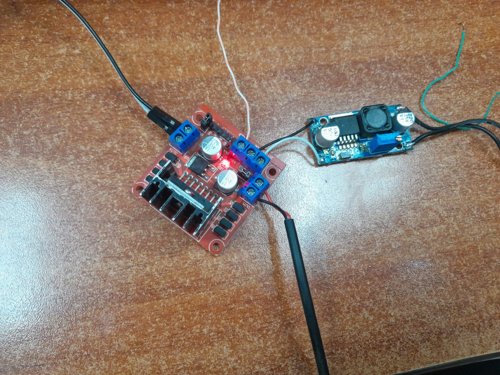
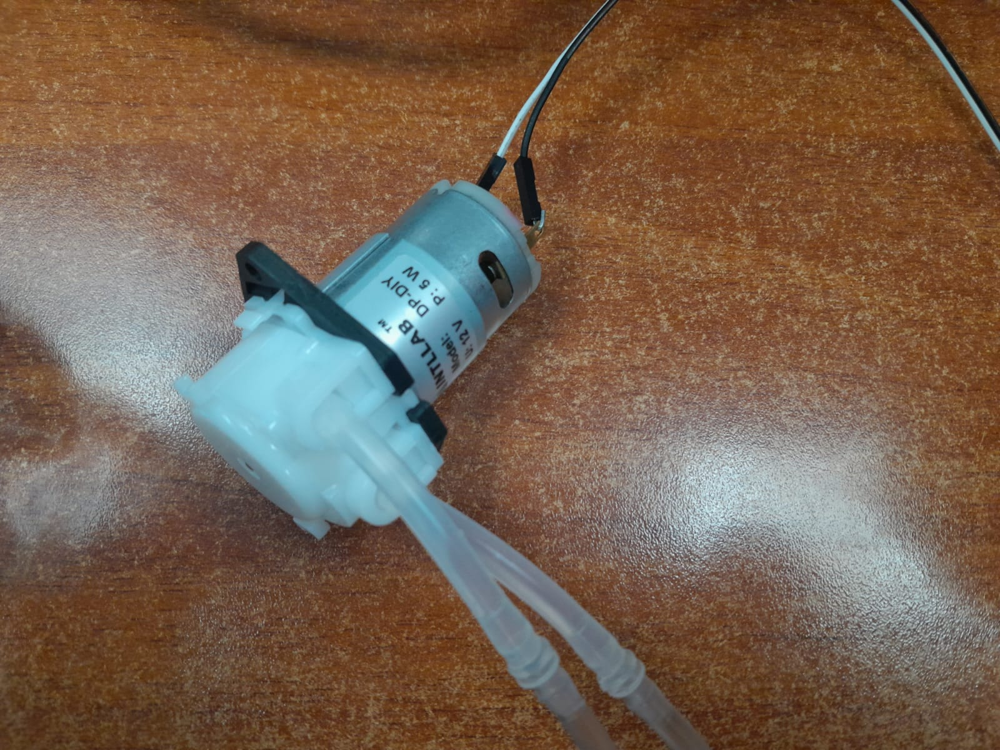

# Proyecto integrador 1ra Entrega

## Integrantes

- [Michael Handrety Fonseca Arana](https://github.com/MichaelJF50)
- [Laura Daniela Rincón Pinilla](https://github.com/Laura03rincon)

## Arquitectura propuesta

Este proyecto permite controlar una bomba peristáltica mediante comunicación MQTT utilizando un ESP32.
El sistema automatiza el inicio y la detención de la bomba según señales enviadas por otros dispositivos en el proceso de mezclado (usuario y galga).

## ⚙️ Funcionamiento General

### 🟢 Inicio del proceso
- El **usuario selecciona el color de pintura** que desea dosificar.  
- Se envía un **mensaje MQTT** con el tema `bomba/control` y el valor `ON`.  
- El **ESP32 enciende la bomba peristáltica** (salida en el pin **GPIO 32**) y el **LED indicador** (pin **GPIO 2**).  

### 🔴 Finalización del proceso
- Cuando la **galga detecta que se alcanzó el peso indicado**, envía un **mensaje MQTT** con el tema `bomba/control` y el valor `OFF`.  
- El **ESP32 apaga la bomba** y publica el estado `APAGADA` en el tema `bomba/estado`.  

  

## Periférico a trabajar

  

  

## Avances

<!-- Subir en una carpeta src los códigos que tienen hasta el momento y esta sección agregar lo que consideren necesario referente a sus avances. -->

  

  

  

  

