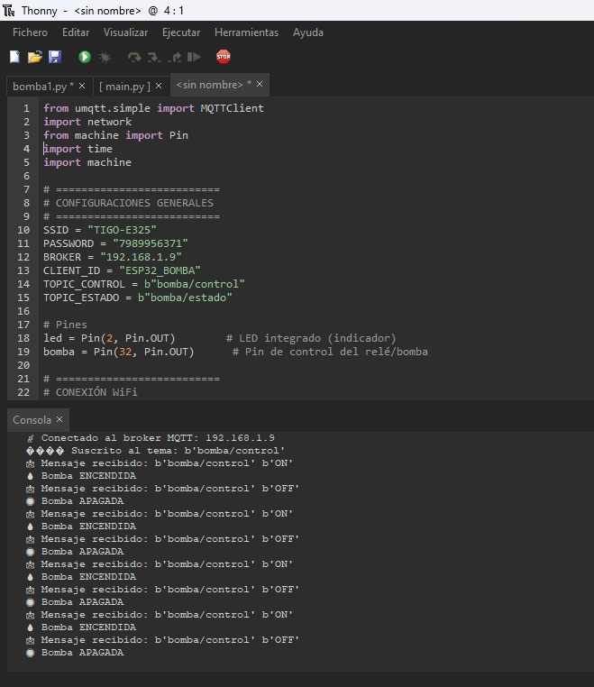
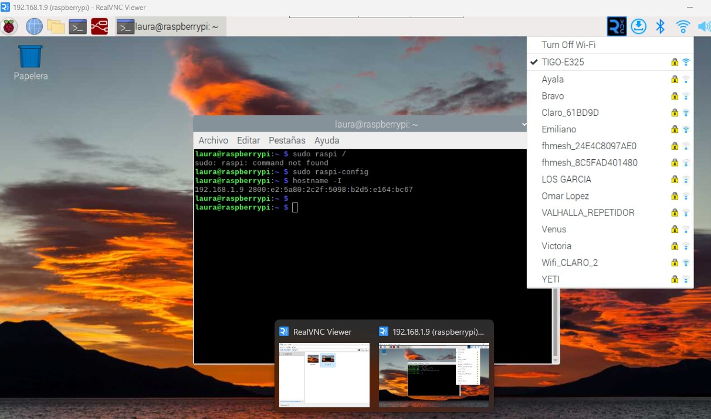
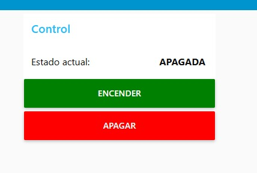

# Proyecto integrador 1ra Entrega

## Integrantes

- [Michael Handrety Fonseca Arana](https://github.com/MichaelJF50)
- [Laura Daniela Rincón Pinilla](https://github.com/Laura03rincon)

## Arquitectura propuesta

  

  

  

  

## Periférico a trabajar

## Avances

<!-- Subir en una carpeta src los códigos que tienen hasta el momento y esta sección agregar lo que consideren necesario referente a sus avances. -->
